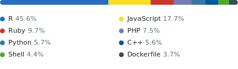

# Andrew Harvey

**Marine biodiversity & fisheries consultant | Data science | International development**

Independent consultant specialising in marine biodiversity and fisheries across international development contexts. I work across the full data pipeline — from designing and building field data capture devices through to statistical analysis, modelling, and reporting. Active across the Asia-Pacific, Southeast Asia, and East Africa.

---

### GitHub activity

<!-- GitHub Streak — uses <picture> to switch theme with GitHub's light/dark mode -->

  <picture>
    <source media="(prefers-color-scheme: dark)" srcset="https://github-readme-streak-stats.herokuapp.com/?user=ahharvey&theme=dark&hide_border=true&background=00000000" />
    <source media="(prefers-color-scheme: light)" srcset="https://github-readme-streak-stats.herokuapp.com/?user=ahharvey&theme=default&hide_border=true&background=00000000" />
    
  </picture>

<!-- Top Languages (generated weekly via GitHub Actions — includes private repos) -->

  <picture>
    <source media="(prefers-color-scheme: dark)" srcset="./stats/languages-dark.svg" />
    <source media="(prefers-color-scheme: light)" srcset="./stats/languages-light.svg" />
    
  </picture>

---

### Tools & technologies

<table>
<tr>
<td><strong>Data & analysis</strong></td>
<td>
  
  
  
</td>
</tr>
<tr>
<td><strong>Web & applications</strong></td>
<td>
  
  
  
</td>
</tr>
<tr>
<td><strong>Hardware & data capture</strong></td>
<td>
  
  
  
</td>
</tr>
<tr>
<td><strong>Publishing</strong></td>
<td>
  
  
</td>
</tr>
<tr>
<td><strong>AI & automation</strong></td>
<td>
  
</td>
</tr>
<tr>
<td><strong>Infrastructure</strong></td>
<td>
  
  
  
</td>
</tr>
</table>

